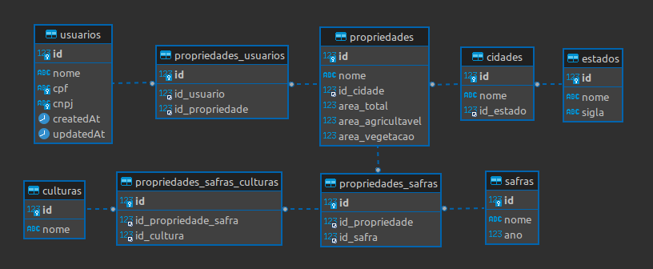

# BATest

Api com AdonisJS configurado para gerenciar usuários, estados, cidades, fazendas, safras, culturas e relatórios. Abaixo estão as rotas disponíveis no sistema.

## Tecnologias Utilizadas

- [AdonisJS 6](https://adonisjs.com/)
- Node.js
- PostgreSQL
- ORM: Lucid

## Instalação

1. Clone o repositório:

   ```bash
   git clone https://github.com/seu-usuario/seu-repositorio.git
   cd seu-repositorio

   Instale as dependências:
    npm install
   Configure o ambiente:
    Copie o arquivo .env.example e renomeie-o para .env.
    Atualize as variáveis de ambiente conforme necessário.
   Inicie o servidor:
    node ace serve --watch
   ```

## Banco de Dados



sql: [Arquivo para criar as tabelas](sql.sql)

Arquivo do Insonmia para simular as rotas: [Insonmia](Insomnia_2025-01-26.json)

## Rotas

**GET /users-farms**: Buscar todos produtores com fazendas cadastradas e suas safras.

**Response:**

```json
[
  {
    "id": 1,
    "name": "João Silva",
    "cpf": "12345678901",
    "cnpj": null,
    "userFarms": [
      {
        "id": 1,
        "name": "Fazenda Boa Vista",
        "cityId": 1,
        "totalArea": "500.00",
        "arableArea": "300.00",
        "vegetationArea": "200.00",
        "farmSeasons": [
          {
            "id": 1,
            "name": "Safra 2021",
            "year": 2021,
            "crops": [
              {
                "id": 1,
                "name": "Soja"
              },
              {
                "id": 2,
                "name": "Milho"
              }
            ]
          },
          {
            "id": 2,
            "name": "Safra 2022",
            "year": 2022,
            "crops": [
              {
                "id": 3,
                "name": "Trigo"
              }
            ]
          }
        ],
        "city": {
          "id": 1,
          "name": "São Paulo",
          "stateId": 1,
          "state": {
            "id": 1,
            "name": "São Paulo",
            "acronym": "SP"
          }
        }
      }
    ]
  },
  {
    "id": 2,
    "name": "Maria Oliveira",
    "cpf": "98765432100",
    "cnpj": null,
    "userFarms": [
      {
        "id": 2,
        "name": "Fazenda Primavera",
        "cityId": 2,
        "totalArea": "800.00",
        "arableArea": "600.00",
        "vegetationArea": "200.00",
        "farmSeasons": [
          {
            "id": 1,
            "name": "Safra 2021",
            "year": 2021,
            "crops": [
              {
                "id": 4,
                "name": "Café"
              }
            ]
          },
          {
            "id": 3,
            "name": "Safra 2023",
            "year": 2023,
            "crops": [
              {
                "id": 1,
                "name": "Soja"
              }
            ]
          }
        ],
        "city": {
          "id": 2,
          "name": "Belo Horizonte",
          "stateId": 2,
          "state": {
            "id": 2,
            "name": "Minas Gerais",
            "acronym": "MG"
          }
        }
      }
    ]
  },
  {
    "id": 3,
    "name": "Pedro Santos",
    "cpf": "45678912300",
    "cnpj": null,
    "userFarms": [
      {
        "id": 3,
        "name": "Fazenda Vale Verde",
        "cityId": 3,
        "totalArea": "1200.00",
        "arableArea": "1000.00",
        "vegetationArea": "200.00",
        "farmSeasons": [
          {
            "id": 2,
            "name": "Safra 2022",
            "year": 2022,
            "crops": [
              {
                "id": 2,
                "name": "Milho"
              }
            ]
          }
        ],
        "city": {
          "id": 3,
          "name": "Curitiba",
          "stateId": 3,
          "state": {
            "id": 3,
            "name": "Paraná",
            "acronym": "PR"
          }
        }
      }
    ]
  },
  {
    "id": 6,
    "name": "Test",
    "cpf": "82782266012",
    "cnpj": "15469088000162",
    "userFarms": [
      {
        "id": 8,
        "name": "Fazenda 1",
        "cityId": 1,
        "totalArea": "100.00",
        "arableArea": "50.00",
        "vegetationArea": "50.00",
        "farmSeasons": [
          {
            "id": 4,
            "name": "Safra 2025",
            "year": 2025,
            "crops": [
              {
                "id": 1,
                "name": "Soja"
              },
              {
                "id": 4,
                "name": "Café"
              }
            ]
          }
        ],
        "city": {
          "id": 1,
          "name": "São Paulo",
          "stateId": 1,
          "state": {
            "id": 1,
            "name": "São Paulo",
            "acronym": "SP"
          }
        }
      }
    ]
  }
]
```

**POST /users**: Cadastrar produtor.

- name String
- cpf Number
- cnpj Number

**Request:**

```json
{
  "name": "Test",
  "cpf": "82782266012",
  "cnpj": "15469088000162"
}
```

**Response:**

```json
{
  "name": "Test",
  "cpf": "82782266012",
  "cnpj": "15469088000162",
  "id": 5
}
```

---

**GET /users**: Buscar produtores.

**Response:**

```json
[
  {
    "id": 5,
    "name": "Test",
    "cpf": "82782266012",
    "cnpj": "15469088000162"
  },
  {
    "id": 3,
    "name": "Pedro Santos",
    "cpf": "45678912300",
    "cnpj": null
  },
  {
    "id": 2,
    "name": "Maria Oliveira",
    "cpf": "98765432100",
    "cnpj": null
  },
  {
    "id": 1,
    "name": "João Silva",
    "cpf": "12345678901",
    "cnpj": null
  }
]
```

---

**PUT /users/:id**: Editar produtor.

- name String
- cpf Number
- cnpj Number

**Request:**

```json
{
  "name": "Test 2"
}
```

**Response:**

```json
{
  "id": 5,
  "name": "Test 2",
  "cpf": "82782266012",
  "cnpj": "15469088000162"
}
```

---

**DELETE /users/:id**: Deletar produtor.

**Response:**

```json
{
  "message": "User deleted successfully"
}
```

---

**POST /states**: Cadastrar estados.

- name String
- acronym String (2)

**Request:**

```json
{
  "name": "Rio Grande do Sul",
  "acronym": "RS"
}
```

**Response:**

```json
{
  "name": "Rio Grande do Sul",
  "acronym": "RS",
  "id": 4
}
```

---

**GET /states**: Listar estados.

**Response:**

```json
[
  {
    "id": 4,
    "name": "Rio Grande do Sul",
    "acronym": "RS"
  },
  {
    "id": 3,
    "name": "Paraná",
    "acronym": "PR"
  },
  {
    "id": 2,
    "name": "Minas Gerais",
    "acronym": "MG"
  },
  {
    "id": 1,
    "name": "São Paulo",
    "acronym": "SP"
  }
]
```

---

**POST /cities**: Cadastrar cidades.

- name String
- stateId Number - id do estado

**Request:**

```json
{
  "name": "Três de Maio",
  "stateId": 4
}
```

**Response:**

```json
{
  "name": "Três de Maio",
  "stateId": 4,
  "id": 6
}
```

---

**GET /cities**: Listar cidades.

**Response:**

```json
[
  {
    "id": 1,
    "name": "São Paulo",
    "stateId": 1,
    "state": {
      "id": 1,
      "name": "São Paulo",
      "acronym": "SP"
    }
  },
  {
    "id": 2,
    "name": "Belo Horizonte",
    "stateId": 2,
    "state": {
      "id": 2,
      "name": "Minas Gerais",
      "acronym": "MG"
    }
  },
  {
    "id": 3,
    "name": "Curitiba",
    "stateId": 3,
    "state": {
      "id": 3,
      "name": "Paraná",
      "acronym": "PR"
    }
  },
  {
    "id": 4,
    "name": "Campinas",
    "stateId": 1,
    "state": {
      "id": 1,
      "name": "São Paulo",
      "acronym": "SP"
    }
  },
  {
    "id": 5,
    "name": "Uberlândia",
    "stateId": 2,
    "state": {
      "id": 2,
      "name": "Minas Gerais",
      "acronym": "MG"
    }
  },
  {
    "id": 6,
    "name": "Três de Maio",
    "stateId": 4,
    "state": {
      "id": 4,
      "name": "Rio Grande do Sul",
      "acronym": "RS"
    }
  }
]
```

---

**POST /crops**: Cadastrar culturas.

- name String

**Request:**

```json
{
  "name": "Batata"
}
```

**Response:**

```json
{
  "name": "Batata",
  "id": 5
}
```

---

**GET /crops**: Listar culturas.

**Response:**

```json
[
  {
    "id": 5,
    "name": "Batata"
  },
  {
    "id": 4,
    "name": "Café"
  },
  {
    "id": 3,
    "name": "Trigo"
  },
  {
    "id": 2,
    "name": "Milho"
  },
  {
    "id": 1,
    "name": "Soja"
  }
]
```

---

**POST /seasons**: Cadastrar safras.

- name String
- year Number

**Request:**

```json
{
  "name": "Safra 2025",
  "year": 2025
}
```

**Response:**

```json
{
  "name": "Safra 2025",
  "year": 2025,
  "id": 4
}
```

---

**GET /seasons**: Listar safras.

**Response:**

```json
[
  {
    "id": 4,
    "name": "Safra 2025",
    "year": 2025
  },
  {
    "id": 3,
    "name": "Safra 2023",
    "year": 2023
  },
  {
    "id": 2,
    "name": "Safra 2022",
    "year": 2022
  },
  {
    "id": 1,
    "name": "Safra 2021",
    "year": 2021
  }
]
```

---

**POST /farms**: Cadastrar fazendas (propriedades).

- name String
- cityId Number - Id da cidade
- totalArea Number - Área total da fazenda (em hectares)
- arableArea Number - Área agricultável (em hectares)
- vegetationArea Number - Área de vegetação (em hectares)
- userId Number - Id do usuário

**Request:**

```json
{
  "name": "Fazenda 1",
  "cityId": 1,
  "totalArea": 100,
  "arableArea": 50,
  "vegetationArea": 50,
  "userId": 6
}
```

**Response:**

```json
{
  "name": "Fazenda 1",
  "cityId": 1,
  "totalArea": 100,
  "arableArea": 50,
  "vegetationArea": 50,
  "id": 8
}
```

---

**GET /farms**: Listar fazendas (propriedades).

**Response:**

```json
[
  {
    "id": 1,
    "name": "Fazenda Boa Vista",
    "cityId": 1,
    "totalArea": "500.00",
    "arableArea": "300.00",
    "vegetationArea": "200.00",
    "city": {
      "id": 1,
      "name": "São Paulo",
      "stateId": 1
    }
  },
  {
    "id": 2,
    "name": "Fazenda Primavera",
    "cityId": 2,
    "totalArea": "800.00",
    "arableArea": "600.00",
    "vegetationArea": "200.00",
    "city": {
      "id": 2,
      "name": "Belo Horizonte",
      "stateId": 2
    }
  },
  {
    "id": 3,
    "name": "Fazenda Vale Verde",
    "cityId": 3,
    "totalArea": "1200.00",
    "arableArea": "1000.00",
    "vegetationArea": "200.00",
    "city": {
      "id": 3,
      "name": "Curitiba",
      "stateId": 3
    }
  },
  {
    "id": 4,
    "name": "Fazenda do zé neto e cristiano",
    "cityId": 1,
    "totalArea": "100.00",
    "arableArea": "50.00",
    "vegetationArea": "50.00",
    "city": {
      "id": 1,
      "name": "São Paulo",
      "stateId": 1
    }
  },
  {
    "id": 5,
    "name": "Fazenda do zé neto e cristiano",
    "cityId": 1,
    "totalArea": "100.00",
    "arableArea": "50.00",
    "vegetationArea": "50.00",
    "city": {
      "id": 1,
      "name": "São Paulo",
      "stateId": 1
    }
  },
  {
    "id": 6,
    "name": "Fazenda do ratinho",
    "cityId": 1,
    "totalArea": "100.00",
    "arableArea": "50.00",
    "vegetationArea": "50.00",
    "city": {
      "id": 1,
      "name": "São Paulo",
      "stateId": 1
    }
  },
  {
    "id": 7,
    "name": "Fazenda 1",
    "cityId": 1,
    "totalArea": "100.00",
    "arableArea": "50.00",
    "vegetationArea": "50.00",
    "city": {
      "id": 1,
      "name": "São Paulo",
      "stateId": 1
    }
  },
  {
    "id": 8,
    "name": "Fazenda 1",
    "cityId": 1,
    "totalArea": "100.00",
    "arableArea": "50.00",
    "vegetationArea": "50.00",
    "city": {
      "id": 1,
      "name": "São Paulo",
      "stateId": 1
    }
  }
]
```

**POST /farm-seasons**: Vincular fazendas as safras e suas culturas.

- farmId Number - Id da fazenda
- seasonId Number - Id da safra
- cropsIds Array<Number> - Id das culturas

**Request:**

```json
{
  "farmId": 8,
  "seasonId": 4,
  "cropsIds": [1, 4]
}
```

**Response:**

```json
{
  "farmId": 8,
  "seasonId": 4,
  "id": 6
}
```

---

**GET /reports**: Dados para relatório e gráficos.

**Response:**

```json
{
  "totalFarms": 8,
  "totalHectares": 3000,
  "farmsByState": [
    {
      "estado": "São Paulo",
      "total_fazendas": 6
    },
    {
      "estado": "Minas Gerais",
      "total_fazendas": 1
    },
    {
      "estado": "Paraná",
      "total_fazendas": 1
    }
  ],
  "farmsByCulture": [
    {
      "cultura": "Soja",
      "total_propriedades": 3
    },
    {
      "cultura": "Milho",
      "total_propriedades": 2
    },
    {
      "cultura": "Trigo",
      "total_propriedades": 1
    },
    {
      "cultura": "Café",
      "total_propriedades": 2
    }
  ],
  "areaUsage": {
    "agriculturable": 71.67,
    "vegetation": 28.33
  }
}
```
